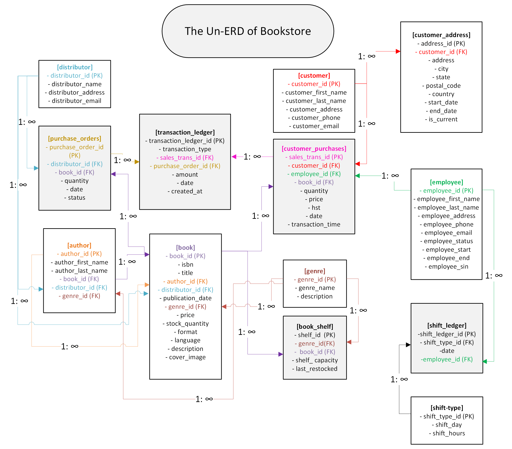

# Assignment 2: Design a Logical Model and Advanced SQL

🚨 **Please review our [Assignment Submission Guide](https://github.com/UofT-DSI/onboarding/blob/main/onboarding_documents/submissions.md)** 🚨 for detailed instructions on how to format, branch, and submit your work. Following these guidelines is crucial for your submissions to be evaluated correctly.

#### Submission Parameters:
* Submission Due Date: `April 27, 2025`
* Weight: 70% of total grade
* The branch name for your repo should be: `assignment-two`
* What to submit for this assignment:
    * This markdown (Assignment2.md) with written responses in Section 1
    * Two Entity-Relationship Diagrams (preferably in a pdf, jpeg, png format).
    * One .sql file 
* What the pull request link should look like for this assignment: `https://github.com/<your_github_username>/sql/pulls/<pr_id>`
    * Open a private window in your browser. Copy and paste the link to your pull request into the address bar. Make sure you can see your pull request properly. This helps the technical facilitator and learning support staff review your submission easily.

Checklist:
- [ ] Create a branch called `assignment-two`.
- [ ] Ensure that the repository is public.
- [ ] Review [the PR description guidelines](https://github.com/UofT-DSI/onboarding/blob/main/onboarding_documents/submissions.md#guidelines-for-pull-request-descriptions) and adhere to them.
- [ ] Verify that the link is accessible in a private browser window.

If you encounter any difficulties or have questions, please don't hesitate to reach out to our team via our Slack at `#cohort-6-help`. Our Technical Facilitators and Learning Support staff are here to help you navigate any challenges.

***

## Section 1:
###  Design a Logical Model


Type 1 overwrites, type 2 doesn't. A picture is worth a thousand words. Here's the ERD with both. 


***

## Section 2:
You can start this section following *session 4*.

Steps to complete this part of the assignment:
- Open the assignment2.sql file in DB Browser for SQLite:
	- from [Github](./02_activities/assignments/assignment2.sql)
	- or, from your local forked repository  
- Complete each question


### Write SQL

#### COALESCE
1. Our favourite manager wants a detailed long list of products, but is afraid of tables! We tell them, no problem! We can produce a list with all of the appropriate details. 


SELECT 

coalesce(product_name || ', ' || product_size|| ' (' || product_qty_type || ')', '') as Products
FROM product


<div align="center">-</div>

#### Windowed Functions
1. Write a query that selects from the customer_purchases table and numbers each customer’s visits to the farmer’s market (labeling each market date with a different number). Each customer’s first visit is labeled 1, second visit is labeled 2, etc. 

SELECT 
    customer_id,
    market_date,
    ROW_NUMBER() OVER(PARTITION BY customer_id ORDER BY market_date) AS visit_number
FROM customer_purchases;

2. Reverse the numbering of the query from a part so each customer’s most recent visit is labeled 1, then write another query that uses this one as a subquery (or temp table) and filters the results to only the customer’s most recent visit.

SELECT
customer_id,
market_date
 from (

SELECT 
    customer_id,
    market_date,
    ROW_NUMBER() OVER(PARTITION BY customer_id ORDER BY market_date DESC) AS visit_number
FROM customer_purchases
)
WHERE visit_number = 1


3. Using a COUNT() window function, include a value along with each row of the customer_purchases table that indicates how many different times that customer has purchased that product_id.

## Zoe: If you need to know how many times each customer purchased something wouldn't you do this? 

SELECT 
    customer_id,
    product_id,
    COUNT(*) AS repeat_purchases
FROM (
    SELECT DISTINCT customer_id, product_id
    FROM customer_purchases
) AS x
GROUP BY  product_id;

## Z: I think this is what you wanted?


SELECT 
    market_date,
	customer_id,
    product_id,
    COUNT(*) OVER (PARTITION BY customer_id, product_id) AS total_purchases
FROM customer_purchases;

/*
##Zoe: then order by market_date or customer_id or product_id*/

<div align="center">-</div>

#### String manipulations
1. Some product names in the product table have descriptions like "Jar" or "Organic". These are separated from the product name with a hyphen. Create a column using SUBSTR (and a couple of other commands) that captures these, but is otherwise NULL. Remove any trailing or leading whitespaces. Don't just use a case statement for each product! 

SELECT 
	product_name,
	CASE
	When INSTR(product_name, ' - ') = 0 Then Null
	ELSE SUBSTR(product_name, INSTR(product_name, '-') + 1)
	end as description
FROM 
Product;

### 2. Filter the query to show any product_size value that contain a number with REGEXP. */

SELECT  
	product_category_id,
	product_size,
	product_qty_type,
	product_name,
			CASE
			When INSTR(product_name, ' - ') = 0 Then Null
			ELSE SUBSTR(product_name, INSTR(product_name, '-') + 1)
			end as description
	
FROM 
Product
Where 
product_size  REGEXP '[0-9]';

<div align="center">-</div>

#### UNION
1. Using a UNION, write a query that displays the market dates with the highest and lowest total sales.

**HINT**: There are a possibly a few ways to do this query, but if you're struggling, try the following: 1) Create a CTE/Temp Table to find sales values grouped dates; 2) Create another CTE/Temp table with a rank windowed function on the previous query to create "best day" and "worst day"; 3) Query the second temp table twice, once for the best day, once for the worst day, with a UNION binding them. 
WITH market_date_rank as (
		SELECT
				market_date,
				sum(quantity*cost_to_customer_per_qty) as sales

		FROM
				customer_purchases
		Group by
				market_date

),
		ranked_by_sales as (
					SELECT 
							market_date,
							sales,
							rank() over (order by sales DESC) as best_day_rank,
							rank() over (order by sales ASC) as worst_day_rank
					FROM
					market_date_rank
)
SELECT 
    market_date,
    sales,
    'Best Day' AS performance
FROM
    ranked_by_sales
WHERE
    best_day_rank = 1

UNION

SELECT 
    market_date,
    sales,
    'Worst Day' AS performance
FROM
    ranked_by_sales
WHERE
    worst_day_rank = 1;
***

## Section 3:
You can start this section following *session 5*.

Steps to complete this part of the assignment:
- Open the assignment2.sql file in DB Browser for SQLite:
	- from [Github](./02_activities/assignments/assignment2.sql)
	- or, from your local forked repository  
- Complete each question

### Write SQL

#### Cross Join
1. Suppose every vendor in the `vendor_inventory` table had 5 of each of their products to sell to **every** customer on record. How much money would each vendor make per product? Show this by vendor_name and product name, rather than using the IDs.

**HINT**: Be sure you select only relevant columns and rows. Remember, CROSS JOIN will explode your table rows, so CROSS JOIN should likely be a subquery. Think a bit about the row counts: how many distinct vendors, product names are there (x)? How many customers are there (y). Before your final group by you should have the product of those two queries (x\*y). 
WITH vendor_products AS (
    SELECT 
        vendor.vendor_name,
        product.product_name,
        vendor_inventory.original_price
    FROM
        vendor_inventory
        INNER JOIN vendor ON vendor_inventory.vendor_id = vendor.vendor_id
        INNER JOIN product ON vendor_inventory.product_id = product.product_id
),
customer_count as (
SELECT 
    COUNT(*) AS total_customers 
FROM 
    customer
)

	SELECT DISTINCT
		vendor_products.vendor_name,
        vendor_products.product_name,
        vendor_products.original_price * 5 * customer_count.total_customers as total_potential_revenue
	FROM
		vendor_products
		
	CROSS JOIN customer_count
ORDER BY 
	vendor_products.vendor_name,
        vendor_products.product_name

<div align="center">-</div>

#### INSERT
1. Create a new table "product_units". This table will contain only products where the `product_qty_type = 'unit'`. It should use all of the columns from the product table, as well as a new column for the `CURRENT_TIMESTAMP`.  Name the timestamp column `snapshot_timestamp`.

DROP TABLE IF EXISTS product_units;

CREATE TABLE product_units AS
SELECT 
    *,
    CURRENT_TIMESTAMP AS snapshot_timestamp
FROM
    product
WHERE
    product_qty_type = 'unit';


2. Using `INSERT`, add a new row to the product_unit table (with an updated timestamp). This can be any product you desire (e.g. add another record for Apple Pie). 

INSERT INTO product_units (product_id,product_name,product_size,product_category_id,product_qty_type,snapshot_timestamp)
VALUES(24, 'SQL Pie', 'enormous',3,'unit', CURRENT_TIMESTAMP)

<div align="center">-</div>

#### DELETE 
1. Delete the older record for the whatever product you added.

**HINT**: If you don't specify a WHERE clause, [you are going to have a bad time](https://imgflip.com/i/8iq872).

DELETE FROM product_units
WHERE product_id = 24;

<div align="center">-</div>

#### UPDATE
1. We want to add the current_quantity to the product_units table. First, add a new column, `current_quantity` to the table using the following syntax.
```
ALTER TABLE product_units
ADD current_quantity INT;
```

Then, using `UPDATE`, change the current_quantity equal to the **last** `quantity` value from the vendor_inventory details. 

UPDATE product_units
SET current_quantity = INT;


SELECT 
    coalesce(quantity, 0) as quantity,
    market_date,
    product_id
FROM 
    vendor_inventory
WHERE 
    (product_id, market_date) IN (
        SELECT 
            product_id, 
            MAX(market_date)
        FROM 
            vendor_inventory
        GROUP BY 
            product_id
    );


    UPDATE product_units
SET current_quantity = (
    SELECT 
        COALESCE(quantity, 0)
    FROM 
        vendor_inventory
    WHERE 
        vendor_inventory.product_id = product_units.product_id
        AND market_date = (
            SELECT 
                MAX(market_date)
            FROM 
                vendor_inventory
            WHERE 
                vendor_inventory.product_id = product_units.product_id
        )
)
WHERE 
    product_id IN (
        SELECT DISTINCT product_id
        FROM vendor_inventory
    );
### this eventually worked but I couldn't get rid of the null values

**HINT**: This one is pretty hard. First, determine how to get the "last" quantity per product. Second, coalesce null values to 0 (if you don't have null values, figure out how to rearrange your query so you do.) Third, `SET current_quantity = (...your select statement...)`, remembering that WHERE can only accommodate one column. Finally, make sure you have a WHERE statement to update the right row, you'll need to use `product_units.product_id` to refer to the correct row within the product_units table. When you have all of these components, you can run the update statement.
